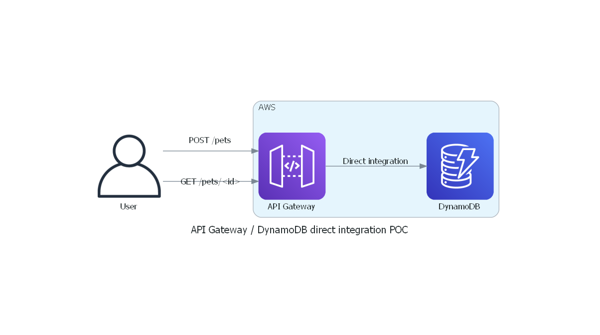

# ServerLess snippet: AWS API Gateway - DynamoDB direct integration with Terraform

## What does it do?
This repository contains a fully-functional Terraform example code 
to deploy a direct integration between AWS API Gateway and AWS DynamoDB:
* A DynamoDB table will contain Pets
* An API Gateway (with stage, API key generation...) exposes 2 methods:
  * POST /pets to push Linky data to the DynamoDB
  * GET /pets/id to query data from the db

The purpose is to show what can be done with API Gateway native integration,
using Apache Velocity Template Language, without adding any additional compute 
resources, such as Lambda.

The example is a basic "pets API". Pets are partitioned by Owner in the DynamoDB.

## Schema

## Content
* dynamodb.tf creates the DynamoDB table and the role required to read and write in it
* apigateway.tf creates all the required resources linked to API Gateway, except for:
  * Models, described in models.tf
  * VTL Mappings (which included the "magic" that would otherwise require a Lambda function) described in apigateway-vtl-mappings.tf

## How-to deploy this?
* I use SSO, hence the "profile" variable. With minimal knowledge of Terraform, you should be able to deploy your way.

## Testing
A PostMan collection can be found [here](doc/poc.postman_collection.json)

